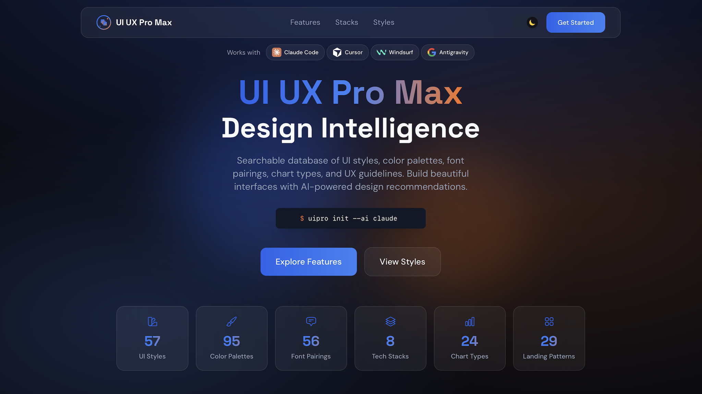

# [UI UX Pro Max](https://uupm.cc)

<p align="center">
  <a href="https://github.com/nextlevelbuilder/ui-ux-pro-max-skill/blob/main/README.vi.md">🇻🇳 Tiếng Việt</a> |
  <a href="https://github.com/nextlevelbuilder/ui-ux-pro-max-skill/blob/main/README.zh.md">🇨🇳 简体中文</a> |
  <a href="https://github.com/nextlevelbuilder/ui-ux-pro-max-skill/blob/main/README.md">🇺🇸 English</a>
</p>

<p align="center">
  <a href="https://github.com/nextlevelbuilder/ui-ux-pro-max-skill/releases"></a>
  
  
  
  <a href="https://github.com/nextlevelbuilder/ui-ux-pro-max-skill/blob/main/LICENSE"></a>
</p>

<p align="center">
  <a href="https://www.npmjs.com/package/ui-ux-pro-max-cli"></a>
  <a href="https://www.npmjs.com/package/ui-ux-pro-max-cli"></a>
  <a href="https://github.com/nextlevelbuilder/ui-ux-pro-max-skill/stargazers"></a>
  <a href="https://paypal.me/uiuxpromax"></a>
</p>

Một kỹ năng AI cung cấp tri thức thiết kế để xây dựng UI/UX chuyên nghiệp trên nhiều nền tảng và framework.

<p align="center">
  <a href="https://uupm.cc">
    
  </a>
</p>

<p align="center">
  <b>Nếu dự án hữu ích với bạn, hãy cân nhắc ủng hộ:</b><br><br>
  <a href="https://paypal.me/uiuxpromax"></a>
</p>

<p align="center">
  <i>Các dự án khác</i><br>
  <a href="https://nextlevelbuilder.io">NextLevelBuilder.io</a> | <a href="https://goclaw.sh">GoClaw.sh</a> | <a href="https://claudekit.cc">ClaudeKit.cc</a> | <a href="https://tose.sh">TOSE.sh</a>
</p>

## Có gì mới trong v2.0

### Tạo hệ thống thiết kế thông minh

Tính năng chủ lực của v2.0 là **Trình tạo hệ thống thiết kế** — một bộ máy suy luận được hỗ trợ bởi AI, có thể phân tích yêu cầu dự án và tạo ra một hệ thống thiết kế hoàn chỉnh, phù hợp chỉ trong vài giây.

```
+----------------------------------------------------------------------------------------+
|  MỤC TIÊU: Serenity Spa - HỆ THỐNG THIẾT KẾ ĐƯỢC ĐỀ XUẤT                              |
+----------------------------------------------------------------------------------------+
|                                                                                        |
|  BỐ CỤC: Tập trung vào Hero + Bằng chứng xã hội                                        |
|     Chuyển đổi: Thúc đẩy bằng cảm xúc kết hợp các yếu tố tạo niềm tin                  |
|     CTA: Nằm trong màn hình đầu tiên, lặp lại sau phần đánh giá                        |
|     Các phần:                                                                          |
|       1. Hero                                                                          |
|       2. Dịch vụ                                                                       |
|       3. Đánh giá                                                                      |
|       4. Đặt lịch                                                                      |
|       5. Liên hệ                                                                       |
|                                                                                        |
|  PHONG CÁCH: Soft UI Evolution                                                         |
|     Từ khóa: Bóng đổ mềm, chiều sâu tinh tế, thư thái, cao cấp, hình dạng hữu cơ        |
|     Phù hợp: Chăm sóc sức khỏe, làm đẹp, thương hiệu phong cách sống, dịch vụ cao cấp   |
|     Hiệu năng: cost:low | Khả năng tiếp cận: risk:conditional; cần xác minh yêu cầu    |
|                                                                                        |
|  MÀU SẮC:                                                                              |
|     Chính:     #E8B4B8 (Hồng nhạt)                                                     |
|     Phụ:       #A8D5BA (Xanh xô thơm)                                                  |
|     CTA:       #D4AF37 (Vàng kim)                                                      |
|     Nền:       #FFF5F5 (Trắng ấm)                                                      |
|     Văn bản:   #2D3436 (Xám than)                                                      |
|     Ghi chú: Bảng màu dịu nhẹ, nhấn vàng kim để tạo cảm giác sang trọng                |
|                                                                                        |
|  KIỂU CHỮ: Cormorant Garamond / Montserrat                                             |
|     Sắc thái: Thanh lịch, thư thái, tinh tế                                            |
|     Phù hợp: Thương hiệu xa xỉ, chăm sóc sức khỏe, làm đẹp, biên tập                   |
|     Google Fonts: https://fonts.google.com/share?selection.family=...                  |
|                                                                                        |
|  HIỆU ỨNG CHÍNH:                                                                       |
|     Bóng đổ mềm + Chuyển tiếp phù hợp ngữ cảnh + Trạng thái hover nhẹ nhàng             |
|                                                                                        |
|  CẦN TRÁNH (Anti-pattern):                                                             |
|     Màu neon chói + Hoạt ảnh gắt + Chế độ tối + Gradient tím/hồng kiểu AI              |
|                                                                                        |
|  DANH SÁCH KIỂM TRA TRƯỚC KHI BÀN GIAO:                                                |
|     [ ] Không dùng emoji làm biểu tượng (dùng SVG: Heroicons/Lucide)                   |
|     [ ] cursor-pointer cho mọi phần tử có thể nhấp                                     |
|     [ ] Thời lượng tương tác phù hợp nền tảng, thành phần và tùy chọn người dùng        |
|     [ ] Chế độ sáng: độ tương phản văn bản tối thiểu 4.5:1                             |
|     [ ] Trạng thái focus hiển thị rõ khi điều hướng bằng bàn phím                      |
|     [ ] Tôn trọng prefers-reduced-motion                                               |
|     [ ] Văn bản, chip và badge tự dàn lại, không bị cắt hay vỡ nhãn                    |
|     [ ] Responsive: 375px, 768px, 1024px, 1440px                                       |
|                                                                                        |
+----------------------------------------------------------------------------------------+
```

### Cách hệ thống thiết kế được tạo ra

```
┌─────────────────────────────────────────────────────────────────┐
│  1. YÊU CẦU CỦA NGƯỜI DÙNG                                     │
│     "Xây dựng landing page cho spa làm đẹp của tôi"            │
└─────────────────────────────────────────────────────────────────┘
                              │
                              ▼
┌─────────────────────────────────────────────────────────────────┐
│  2. TÌM KIẾM ĐA MIỀN (5 lượt tìm kiếm song song)                │
│     • Đối sánh loại sản phẩm (192 danh mục)                     │
│     • Đề xuất phong cách (79 có thể tìm kiếm; 50 đang hoạt động)│
│     • Chọn bảng màu (192 bảng màu)                              │
│     • Mẫu landing page (34 mẫu)                                 │
│     • Kết hợp kiểu chữ (74 cặp phông chữ)                       │
└─────────────────────────────────────────────────────────────────┘
                              │
                              ▼
┌─────────────────────────────────────────────────────────────────┐
│  3. BỘ MÁY SUY LUẬN                                             │
│     • Đối sánh sản phẩm → quy tắc danh mục UI                   │
│     • Áp dụng mức ưu tiên phong cách (xếp hạng BM25)            │
│     • Lọc anti-pattern theo ngành                               │
│     • Xử lý quy tắc quyết định (điều kiện JSON)                 │
└─────────────────────────────────────────────────────────────────┘
                              │
                              ▼
┌─────────────────────────────────────────────────────────────────┐
│  4. ĐẦU RA HỆ THỐNG THIẾT KẾ HOÀN CHỈNH                         │
│     Bố cục + Phong cách + Màu sắc + Kiểu chữ + Hiệu ứng         │
│     + Anti-pattern cần tránh + Danh sách kiểm tra trước bàn giao│
└─────────────────────────────────────────────────────────────────┘
```

### 192 quy tắc suy luận dành riêng cho từng ngành

Bộ máy suy luận có các quy tắc chuyên biệt cho:

| Danh mục | Ví dụ |
|----------|-------|
| **Công nghệ & SaaS** | SaaS, Micro SaaS, dịch vụ B2B, công cụ lập trình/IDE, nền tảng AI/chatbot, nền tảng an ninh mạng |
| **Tài chính** | Fintech/crypto, ngân hàng, bảo hiểm, theo dõi tài chính cá nhân, công cụ hóa đơn & thanh toán |
| **Chăm sóc sức khỏe** | Phòng khám, nhà thuốc, nha khoa, thú y, sức khỏe tinh thần, nhắc uống thuốc |
| **Thương mại điện tử** | Tổng hợp, xa xỉ, chợ P2P, hộp đăng ký định kỳ, giao đồ ăn |
| **Dịch vụ** | Làm đẹp/spa, nhà hàng, khách sạn, pháp lý, dịch vụ gia đình, đặt lịch & cuộc hẹn |
| **Sáng tạo** | Portfolio, agency, nhiếp ảnh, trò chơi, phát nhạc trực tuyến, trình chỉnh sửa ảnh/video |
| **Phong cách sống** | Theo dõi thói quen, công thức & nấu ăn, thiền, thời tiết, nhật ký, theo dõi tâm trạng |
| **Công nghệ mới nổi** | Web3/NFT, điện toán không gian, điện toán lượng tử, đội máy bay không người lái tự hành |

Mỗi quy tắc bao gồm:

- **Bố cục đề xuất** — Cấu trúc landing page
- **Ưu tiên phong cách** — Các phong cách UI phù hợp nhất
- **Sắc thái màu sắc** — Bảng màu phù hợp với ngành
- **Sắc thái kiểu chữ** — Cá tính phông chữ phù hợp
- **Hiệu ứng chính** — Hoạt ảnh và tương tác
- **Anti-pattern** — Những điều KHÔNG nên làm (ví dụ: "gradient tím/hồng kiểu AI" cho ứng dụng ngân hàng)

## Tính năng

- **79 phong cách UI có thể tìm kiếm (50 đang hoạt động)** — Glassmorphism, Claymorphism, Minimalism, Brutalism, Neumorphism, Bento Grid, Dark Mode, AI-Native UI và nhiều hơn nữa
- **192 bảng màu** — Bảng màu theo ngành, tương ứng 1:1 với 192 loại sản phẩm
- **74 cặp phông chữ** — Các tổ hợp kiểu chữ được tuyển chọn, kèm câu lệnh import Google Fonts
- **25 loại biểu đồ** — Đề xuất cho dashboard và phân tích dữ liệu
- **22 tech stack** — React, Next.js, Astro, Vue, Nuxt.js, Nuxt UI, Svelte, SwiftUI, React Native, Flutter, HTML+Tailwind, shadcn/ui, Jetpack Compose, Angular, Laravel, Three.js, JavaFX, WPF, WinUI 3, UWP, Avalonia, Uno Platform
- **119 hướng dẫn UX** — Thực hành tốt, anti-pattern, quy tắc khả năng tiếp cận, bố cục văn bản bền vững, nhãn gọn và tương tác có thể hủy
- **192 quy tắc suy luận** — Tạo hệ thống thiết kế dành riêng cho từng ngành (MỚI trong v2.0)

### Văn bản bền vững và UI nhỏ gọn

Hướng dẫn hiện bao quát các lỗi thường gặp trong môi trường production liên quan đến tiêu đề, chuỗi dài, chip, badge và các vi tương tác bị gián đoạn:

- Ngắt dòng tiêu đề cân đối là một cải tiến tăng dần, không phải bảo đảm rằng một từ cụ thể sẽ luôn nằm ở dòng cuối. Thiết kế vẫn phải hoạt động tốt với cách ngắt dòng tự nhiên trên nhiều độ rộng, phông chữ và ngôn ngữ.
- Văn bản thiết yếu phải tự dàn lại mà không bị cắt ở màn hình hẹp, khi phóng to trình duyệt, tăng cỡ chữ hoặc áp dụng thiết lập giãn cách của người dùng. URL và mã định danh dài có thể xuống dòng an toàn.
- Nhóm chip và tag nên tự xuống dòng hoặc dùng cơ chế mở rộng `+n` có thể thao tác. Nhãn ngắn nên được giữ nguyên vẹn khi có thể; nếu buộc phải cắt ngắn, cần có cách truy cập giá trị đầy đủ cho người dùng bàn phím, con trỏ và cảm ứng.
- Ý nghĩa của badge không được chỉ dựa vào màu sắc. Chip tương tác cần ngữ nghĩa gốc phù hợp, trạng thái focus rõ ràng và trạng thái có thể xác định bằng chương trình; số đếm trực tiếp cần ngữ cảnh có ý nghĩa.
- Tương tác nhanh có thể hủy hoạt ảnh, nhưng trạng thái ngữ nghĩa cuối cùng, focus và nội dung vẫn phải chính xác. Thời lượng cần phù hợp với nền tảng và thành phần, đồng thời tôn trọng tùy chọn giảm chuyển động.

### Phân loại phong cách

Danh mục chứa **79 phong cách có thể tìm kiếm**, được hỗ trợ bởi ID và bí danh ổn định:

| Trạng thái | Số lượng | Hành vi tìm kiếm |
|------------|---------:|------------------|
| Đang hoạt động | 50 | Có trong các đề xuất thông thường và được hiển thị mặc định trong thư viện |
| Bổ sung | 29 | Được trả về khi người dùng yêu cầu chính xác hoặc nêu rõ biến thể/hệ thống; có thể xem bằng bộ lọc trạng thái của thư viện |
| Không còn dùng | 9 | Bị loại khỏi xếp hạng thông thường; tên cũ chuyển hướng đến phong cách chuẩn hoặc mẫu landing page tương ứng |

Nhóm đang hoạt động bao gồm 43 họ phong cách trực quan phổ biến, 2 phong cách riêng cho thiết bị di động, 3 nền tảng/hệ thống thiết kế chính thức, 1 vật liệu nền tảng và 1 phong cách phân tích cốt lõi. Các hệ thống chính thức hiện tại gồm Fluent 2, Shopify Polaris và Adobe Spectrum; Liquid Glass được giới hạn trong phạm vi vật liệu nền tảng Apple, Material 3 Expressive vẫn là một biến thể Material dành cho thiết bị di động, còn Spectrum 2 thuộc nhóm bổ sung. Cấu trúc landing page nằm trong tập dữ liệu riêng gồm 34 mẫu thay vì cạnh tranh với phong cách trực quan trong xếp hạng BM25.

Xem [`styles.csv`](src/ui-ux-pro-max/data/styles.csv) để biết toàn bộ hệ thống phân loại và siêu dữ liệu có thông tin nguồn gốc.

## 💎 So sánh phiên bản Cơ bản và Cao cấp

Nhiều người dùng hỏi về sự khác biệt giữa phiên bản mã nguồn mở và phiên bản cao cấp. Bảng phân tích sau sẽ giúp bạn chọn phiên bản phù hợp với quy trình làm việc.

### 🟢 Phiên bản Cơ bản (repository này)

- **Hoàn toàn mã nguồn mở:** Phù hợp với lập trình viên cá nhân, người làm dự án sở thích và các dự án thông thường.
- **Tri thức UI/UX cốt lõi:** Truy cập đầy đủ 79 phong cách UI có thể tìm kiếm (50 đang hoạt động), 192 loại sản phẩm, bảng màu và các cặp phông chữ được tuyển chọn.
- **Đề xuất thông minh:** Bộ máy tìm kiếm BM25 tích hợp giúp đối sánh thiết kế với độ chính xác cao.
- **Hỗ trợ đa nền tảng:** Hướng dẫn riêng theo stack, hỗ trợ 22 framework lớn (React, Vue, Tailwind, iOS, Android, v.v.).
- **Tạo hệ thống thiết kế:** Tạo tức thì các quy tắc UI, mẫu và logic phù hợp thông qua CLI.

### 🟡 Phiên bản Cao cấp

- **Kỹ năng thiết kế thương hiệu mở rộng:** Không chỉ UI/UX mà còn hỗ trợ tạo bộ nhận diện thương hiệu, thiết kế logo, chương trình nhận diện doanh nghiệp (CIP), banner, slide thuyết trình và biểu tượng tùy chỉnh.
- **Tạo tài nguyên nâng cao:** Tích hợp sâu với công nghệ tạo ảnh bằng AI để tạo tài nguyên trực quan thực tế, không chỉ là placeholder.
- **Kiến trúc doanh nghiệp:** Kiến trúc design token toàn diện và có khả năng mở rộng hơn, dành cho việc triển khai trong các nhóm quy mô lớn.
- **Hỗ trợ ưu tiên:** Hỗ trợ kỹ thuật chuyên biệt cho các nhóm và chuyên gia cần quy trình thiết kế xuyên suốt, không gián đoạn.

👉 *Để biết thêm thông tin về việc nâng cấp lên gói Cao cấp, hãy truy cập [uupm.cc](https://uupm.cc).*

## Cài đặt

### Sử dụng Claude Marketplace (Claude Code)

Cài đặt trực tiếp trong Claude Code bằng hai lệnh:

```
/plugin marketplace add nextlevelbuilder/ui-ux-pro-max-skill
/plugin install ui-ux-pro-max@ui-ux-pro-max-skill
```

### Sử dụng CLI (khuyến nghị)

```bash
# Cài đặt CLI trên toàn hệ thống
npm install -g ui-ux-pro-max-cli

# Đi đến dự án của bạn
cd /path/to/your/project

# Cài đặt cho trợ lý AI của bạn
uipro init --ai claude      # Claude Code
uipro init --ai cursor      # Cursor
uipro init --ai windsurf    # Windsurf
uipro init --ai antigravity # Antigravity
uipro init --ai copilot     # GitHub Copilot
uipro init --ai kiro        # Kiro
uipro init --ai codex       # Codex CLI
uipro init --ai qoder       # Qoder
uipro init --ai roocode     # Roo Code
uipro init --ai gemini      # Gemini CLI
uipro init --ai trae        # Trae
uipro init --ai opencode    # OpenCode
uipro init --ai continue    # Continue
uipro init --ai codebuddy   # CodeBuddy
uipro init --ai droid       # Droid (Factory)
uipro init --ai kilocode    # KiloCode
uipro init --ai warp        # Warp
uipro init --ai augment     # Augment
uipro init --ai codewhale   # CodeWhale
uipro init --ai universal   # Universal / Agent Standard (.agents/skills/)
uipro init --ai all         # Tất cả trợ lý
```

Gói npm là `ui-ux-pro-max-cli`; gói này vẫn cài đặt lệnh `uipro`. Các bản phát hành `uipro-cli` cũ đã lỗi thời và không nên dùng với tài nguyên hiện tại.

### Cài đặt toàn hệ thống (dùng cho mọi dự án)

```bash
uipro init --ai claude --global    # Cài vào ~/.claude/skills/
uipro init --ai cursor --global    # Cài vào ~/.cursor/skills/
uipro init --ai universal --global # Cài vào ~/.agents/skills/
```

### Các lệnh CLI khác

```bash
uipro versions              # Liệt kê các phiên bản có sẵn
uipro update                # Làm mới tệp kỹ năng từ gói CLI đã cài đặt
uipro update --global       # Làm mới tệp kỹ năng toàn hệ thống từ gói CLI đã cài đặt
uipro init --offline        # Cờ tương thích; cài đặt các template đi kèm
uipro uninstall             # Gỡ kỹ năng (tự phát hiện nền tảng)
uipro uninstall --ai claude # Gỡ khỏi một nền tảng cụ thể
uipro uninstall --global    # Gỡ bản cài đặt toàn hệ thống
```

## Điều kiện tiên quyết

Python 3.x là bắt buộc để chạy script tìm kiếm (chỉ sử dụng thư viện chuẩn — các script không cài đặt gì và không thực hiện yêu cầu mạng).

Kiểm tra Python đã được cài đặt hay chưa:

```bash
python3 --version
```

Nếu chưa có, hãy tự cài đặt từ [python.org](https://www.python.org/downloads/) hoặc bằng trình quản lý gói của hệ điều hành (Homebrew, apt, winget). Các bước cài đặt này dành cho **bạn, người dùng trực tiếp** — các AI agent sử dụng kỹ năng này không bao giờ được tự ý cài phần mềm trên máy của bạn; chúng được hướng dẫn phải hỏi bạn trước.

## Cách sử dụng

### Chế độ Kỹ năng (tự động kích hoạt)

**Được hỗ trợ:** Claude Code, Cursor, Windsurf, Antigravity, Codex CLI, Continue, Gemini CLI, OpenCode, Qoder, CodeBuddy, Droid (Factory), KiloCode, Warp, Augment, CodeWhale

Kỹ năng tự động kích hoạt khi bạn yêu cầu công việc UI/UX. Chỉ cần trò chuyện tự nhiên:

```
Xây dựng landing page cho sản phẩm SaaS của tôi
```

> **Trae**: Trước tiên, hãy chuyển sang chế độ **SOLO**. Kỹ năng sẽ kích hoạt khi có yêu cầu UI/UX.

### Chế độ Quy trình (lệnh slash)

**Được hỗ trợ:** Kiro, GitHub Copilot, Roo Code, KiloCode

Dùng lệnh slash để gọi kỹ năng:

```
/ui-ux-pro-max Xây dựng landing page cho sản phẩm SaaS của tôi
```

### Prompt mẫu

```
Xây dựng landing page cho sản phẩm SaaS của tôi

Tạo dashboard phân tích dữ liệu chăm sóc sức khỏe

Thiết kế website portfolio có chế độ tối

Tạo UI ứng dụng thương mại điện tử trên thiết bị di động

Xây dựng ứng dụng ngân hàng fintech với giao diện tối
```

### Cách hoạt động

1. **Bạn đưa ra yêu cầu** — Yêu cầu bất kỳ tác vụ UI/UX nào (xây dựng, thiết kế, tạo, triển khai, đánh giá, sửa hoặc cải thiện)
2. **Hệ thống thiết kế được tạo ra** — AI tự động tạo một hệ thống thiết kế hoàn chỉnh bằng bộ máy suy luận
3. **Đề xuất thông minh** — Dựa trên loại sản phẩm và yêu cầu của bạn, hệ thống tìm phong cách, màu sắc và kiểu chữ phù hợp nhất
4. **Tạo mã nguồn** — Triển khai UI với màu sắc, phông chữ, khoảng cách và các thực hành tốt phù hợp
5. **Kiểm tra trước khi bàn giao** — Đối chiếu với những anti-pattern UI/UX thường gặp

### Các stack được hỗ trợ

Kỹ năng cung cấp hướng dẫn riêng cho từng stack:

| Danh mục | Stack |
|----------|-------|
| **Web (HTML)** | HTML + Tailwind (mặc định) |
| **Hệ sinh thái React** | React, Next.js, shadcn/ui |
| **Hệ sinh thái Vue** | Vue, Nuxt.js, Nuxt UI |
| **Angular** | Angular |
| **PHP** | Laravel (Blade, Livewire, Inertia.js) |
| **Web khác** | Svelte, Astro, Three.js |
| **Máy tính để bàn** | JavaFX, WPF, WinUI 3, Avalonia, Uno Platform, UWP |
| **iOS** | SwiftUI |
| **Android** | Jetpack Compose |
| **Đa nền tảng** | React Native, Flutter |

Chỉ cần nêu stack bạn muốn trong prompt, hoặc để hệ thống dùng HTML + Tailwind theo mặc định.

## Lệnh tạo hệ thống thiết kế (nâng cao)

Để truy cập trực tiếp trình tạo hệ thống thiết kế:

> Lưu ý: Nếu bạn cài đặt qua Continue, hãy thay `.claude/skills/` bằng `.continue/skills/` trong các lệnh bên dưới. Với Droid (Factory), hãy dùng `.factory/skills/`.

```bash
# Tạo hệ thống thiết kế với đầu ra ASCII
python3 .claude/skills/ui-ux-pro-max/scripts/search.py "beauty spa wellness" --design-system -p "Serenity Spa"

# Tạo đầu ra Markdown
python3 .claude/skills/ui-ux-pro-max/scripts/search.py "fintech banking" --design-system -f markdown

# Tìm kiếm theo miền
python3 .claude/skills/ui-ux-pro-max/scripts/search.py "glassmorphism" --domain style
python3 .claude/skills/ui-ux-pro-max/scripts/search.py "elegant serif" --domain typography
python3 .claude/skills/ui-ux-pro-max/scripts/search.py "dashboard" --domain chart
python3 .claude/skills/ui-ux-pro-max/scripts/search.py "error summary validation" --domain ux
python3 .claude/skills/ui-ux-pro-max/scripts/search.py "decorative icon aria hidden" --domain icons
python3 .claude/skills/ui-ux-pro-max/scripts/search.py "icon button accessible label" --domain icons
python3 .claude/skills/ui-ux-pro-max/scripts/search.py "orphan heading line balance" --domain ux
python3 .claude/skills/ui-ux-pro-max/scripts/search.py "badge chip label wraps to second line" --domain ux
python3 .claude/skills/ui-ux-pro-max/scripts/search.py "rapid chip animation interrupted" --domain ux

# Hướng dẫn riêng cho từng stack
python3 .claude/skills/ui-ux-pro-max/scripts/search.py "form validation" --stack react
python3 .claude/skills/ui-ux-pro-max/scripts/search.py "responsive layout" --stack html-tailwind
python3 .claude/skills/ui-ux-pro-max/scripts/search.py "chip badge overflow nowrap" --stack html-tailwind
python3 .claude/skills/ui-ux-pro-max/scripts/search.py "tableview binding" --stack javafx
python3 .claude/skills/ui-ux-pro-max/scripts/search.py "atlantafx primer enterprise theme" --stack javafx
python3 .claude/skills/ui-ux-pro-max/scripts/search.py "enterprise tableview density permission" --stack javafx
```

Tìm kiếm cho web stack có nhận biết phiên bản. Truy vấn không nêu phiên bản chính cũ sẽ trả về hướng dẫn hiện hành, đang được áp dụng. Các thuật ngữ cũ hoặc phiên bản chính cũ được nêu rõ (ví dụ `Svelte 4` hoặc `Next.js 15`) chỉ trả về những dòng hướng dẫn cũ đã được tuyển chọn, có nhãn `Status` và `Applies To`; nếu chưa có hướng dẫn cũ phù hợp, tìm kiếm sẽ không trả về kết quả thay vì trộn lẫn các thế hệ framework.

### Lưu hệ thống thiết kế (mô hình Master + Overrides)

Lưu hệ thống thiết kế vào tệp để **truy xuất phân cấp giữa các phiên làm việc**:

```bash
# Tạo và lưu vào design-system/MASTER.md
python3 .claude/skills/ui-ux-pro-max/scripts/search.py "SaaS dashboard" --design-system --persist -p "MyApp"

# Đồng thời tạo tệp ghi đè riêng cho một trang
python3 .claude/skills/ui-ux-pro-max/scripts/search.py "SaaS dashboard" --design-system --persist -p "MyApp" --page "dashboard"
```

Lệnh trên tạo cấu trúc thư mục `design-system/`:

```
design-system/
├── MASTER.md           # Nguồn tham chiếu chung (màu sắc, kiểu chữ, khoảng cách, thành phần)
└── pages/
    └── dashboard.md    # Ghi đè riêng cho trang (chỉ những điểm khác với Master)
```

**Cách truy xuất phân cấp hoạt động:**

1. Khi xây dựng một trang cụ thể (ví dụ: "Checkout"), trước tiên kiểm tra `design-system/pages/checkout.md`
2. Nếu tệp của trang tồn tại, các quy tắc trong đó sẽ **ghi đè** tệp Master
3. Nếu không, chỉ sử dụng `design-system/MASTER.md`

**Prompt truy xuất theo ngữ cảnh:**

```
Tôi đang xây dựng trang [Tên trang]. Hãy đọc design-system/MASTER.md.
Đồng thời kiểm tra xem design-system/pages/[page-name].md có tồn tại hay không.
Nếu tệp của trang tồn tại, hãy ưu tiên các quy tắc trong đó.
Nếu không, chỉ sử dụng các quy tắc trong tệp Master.
Bây giờ, hãy tạo mã nguồn...
```

## Kiến trúc & Đóng góp

### Dành cho người dùng

Mã nguồn đã được tái cấu trúc để sử dụng **hệ thống tạo dựa trên template**. Tất cả các tệp riêng cho từng nền tảng (`.cursor/`, `.windsurf/`, `.kiro/`, `.factory/`, v.v.) hiện được CLI tạo động.

**Luôn cài đặt bằng CLI:**

```bash
npm install -g ui-ux-pro-max-cli
uipro init --ai <platform>
```

Cách này bảo đảm bạn nhận được các template mới nhất đi kèm gói CLI đã cài và cấu trúc tệp chính xác cho trợ lý AI của mình. Khi có bản phát hành mới, hãy cập nhật gói npm trước.

### Dành cho người đóng góp

Nếu bạn muốn đóng góp cho dự án:

```bash
# 1. Clone repository
git clone https://github.com/nextlevelbuilder/ui-ux-pro-max-skill.git
cd ui-ux-pro-max-skill

# 2. Tìm hiểu cấu trúc
src/ui-ux-pro-max/           # Nguồn chuẩn (dữ liệu, script, template)
cli/                         # Trình cài đặt CLI (tạo tệp từ template)
.claude/                     # Môi trường phát triển/kiểm thử cục bộ cho kỹ năng Claude Code
.factory/                    # Môi trường phát triển/kiểm thử cục bộ cho kỹ năng Droid (Factory)

# 3. Thực hiện thay đổi trong src/ui-ux-pro-max/
# - data/*.csv              → Tệp cơ sở dữ liệu
# - scripts/*.py            → Bộ máy tìm kiếm & hệ thống thiết kế
# - templates/              → Template riêng cho từng nền tảng

# 4. Đồng bộ sang CLI và kiểm thử cục bộ
cd cli
npm run sync:assets
npm run check:assets
npm run verify:data
npm run typecheck

# 5. Build và kiểm thử CLI
# `npm run build` dùng Bun khi có, nếu không sẽ dùng đầu ra của trình biên dịch TypeScript sau `npm ci`.
npm run build
node dist/index.js init --ai claude --offline  # Kiểm thử trong thư mục tạm

# 6. Tạo PR (không bao giờ push trực tiếp lên main)
git checkout -b feat/your-feature
git commit -m "feat: description"
git push -u origin feat/your-feature
gh pr create
```

Xem [CLAUDE.md](CLAUDE.md) để biết hướng dẫn phát triển chi tiết.

### Nguồn gốc và cách làm mới danh mục

Bản tóm tắt danh mục đã commit hiện ghi nhận **1.934 Google Fonts được phê duyệt** cùng **8 mục loại trừ cần xem xét**, không được đưa vào sử dụng nếu thiếu siêu dữ liệu giấy phép chính thức phù hợp. Hướng dẫn biểu tượng vẫn gồm **105 dòng được tuyển chọn** (100 import Phosphor trực tiếp trên web cùng hướng dẫn cho React Native/phương án dự phòng); manifest Phosphor upstream riêng gồm **1.512 biểu tượng** dùng để xác thực tên, độ đậm và import React/SSR mà không làm kết quả tìm kiếm bị ngập bởi toàn bộ gói upstream.

Quy trình phát triển thông thường và CI cho pull request không phụ thuộc mạng. Chạy toàn bộ cổng kiểm tra offline, bao gồm hash snapshot và xác thực số lượng đã tạo, bằng:

```bash
npm --prefix cli run verify:data
# Hoặc chỉ kiểm tra bản tóm tắt danh mục đã tạo:
npm --prefix cli run validate:catalog-summary
```

Quy trình chuẩn hóa khi làm mới cũng có thể chạy hoàn toàn offline với các fixture đã commit. Kết quả được ghi vào một thư mục ứng viên tạm thời và không bao giờ thay thế dữ liệu chuẩn:

```bash
candidate_dir="$(mktemp -d)"
python3 scripts/refresh-google-fonts.py \
  --api-input src/ui-ux-pro-max/scripts/tests/fixtures/catalogs/google-api.json \
  --metadata-input src/ui-ux-pro-max/scripts/tests/fixtures/catalogs/google-metadata.json \
  --existing-csv src/ui-ux-pro-max/scripts/tests/fixtures/catalogs/google-existing.csv \
  --overrides src/ui-ux-pro-max/scripts/tests/fixtures/catalogs/google-overrides.json \
  --output-csv "$candidate_dir/google-fonts.csv" \
  --license-output "$candidate_dir/google-font-licenses.json" \
  --metadata-revision fixture-catalogs-v1 \
  --verified-at 2026-08-13 --expected-count 2 --approve-changes
python3 scripts/refresh-icon-catalog.py \
  --input src/ui-ux-pro-max/scripts/tests/fixtures/catalogs/phosphor-core.json \
  --package-json src/ui-ux-pro-max/scripts/tests/fixtures/catalogs/phosphor-package.json \
  --react-package-json src/ui-ux-pro-max/scripts/tests/fixtures/catalogs/phosphor-react-package.json \
  --react-exports-input src/ui-ux-pro-max/scripts/tests/fixtures/catalogs/phosphor-react-exports.json \
  --curated-csv src/ui-ux-pro-max/scripts/tests/fixtures/catalogs/icons-curated.csv \
  --output "$candidate_dir/phosphor-icons-upstream.json" \
  --verified-at 2026-08-13 --expected-count 2
```

Quy trình làm mới trực tiếp từ upstream được tách riêng có chủ đích trong workflow `refresh-catalogs.yml`, chạy theo lịch vào 03:17 UTC mỗi thứ Hai và cũng có thể chạy theo yêu cầu. Cấu hình `GOOGLE_FONTS_API_KEY` làm GitHub Actions secret, sau đó chạy workflow và tải artifact để xem xét:

```bash
gh workflow run refresh-catalogs.yml
run_id="$(gh run list --workflow refresh-catalogs.yml --limit 1 --json databaseId --jq '.[0].databaseId')"
gh run watch "$run_id"
gh run download "$run_id" --name "catalog-refresh-review-$run_id"
```

Workflow đọc Google Fonts Developer API và các gói Phosphor chính thức đã được cố định phiên bản, ghi các tệp ứng viên cùng unified diff vào artifact và chỉ có quyền đọc repository. Workflow không bao giờ commit, push, mở PR hoặc merge. Hãy xem xét báo cáo thay đổi, mục loại trừ, giấy phép, chỉ số liên quan và cổng kiểm tra offline trước khi tự đưa các tệp ứng viên vào `src/ui-ux-pro-max/data/`.

## Phát hành tự động

Repository này sử dụng semantic-release cùng Conventional Commits để tự động tạo bản phát hành GitHub:

- Nhánh `dev` tạo các bản phát hành thử nghiệm GitHub, chẳng hạn `2.6.0-beta.1`.
- Nhánh `main` tạo các bản phát hành ổn định chính thức, chẳng hạn `2.6.0`.

Ghi chú phát hành và `CHANGELOG.md` được tạo từ các thông điệp Conventional Commit. Trong quá trình chuẩn bị phát hành, số phiên bản được đồng bộ giữa `skill.json`, `.claude-plugin/plugin.json`, `.claude-plugin/marketplace.json`, `cli/package.json` và `cli/package-lock.json`.

Dùng các loại commit sau để tăng phiên bản chính xác:

- `fix:` → bản vá
- `feat:` → phiên bản phụ
- `feat!:` hoặc `BREAKING CHANGE:` → phiên bản chính

Workflow phát hành sử dụng `GITHUB_TOKEN` mặc định để tạo bản phát hành GitHub và secret `NPM_TOKEN` của repository để phát hành `ui-ux-pro-max-cli` lên npm.

## Khắc phục sự cố

### `uipro: unknown command 'uninstall'` hoặc `unknown command 'update'`

Phiên bản `ui-ux-pro-max-cli` đã cài của bạn đã cũ. Hãy cập nhật rồi thử lại:

```bash
npm install -g ui-ux-pro-max-cli@latest
uipro uninstall
```

### `uipro uninstall` báo "No installed AI skill directories detected"

Kỹ năng được cài trong một thư mục khác với thư mục bạn đang chạy lệnh. Bạn có thể:

```bash
# Phương án A — chạy từ thư mục gốc của dự án nơi bạn đã cài đặt ban đầu
cd /path/to/your/project
uipro uninstall

# Phương án B — gỡ bản cài đặt toàn hệ thống
uipro uninstall --global

# Phương án C — gỡ thủ công
rm -rf .claude/skills/ui-ux-pro-max   # Claude Code
rm -rf .cursor/skills/ui-ux-pro-max   # Cursor
rm -rf .windsurf/skills/ui-ux-pro-max # Windsurf
rm -rf .agents/skills/ui-ux-pro-max   # Antigravity / Codex
```

### Hộp thoại "Upload a skill" của Claude.ai báo "Zip contains too many files (maximum 200)"

Không tải lên tệp ZIP chứa toàn bộ repository GitHub. Đây là bản mã nguồn dành cho phát triển, bao gồm mã nguồn, tài nguyên CLI, tài liệu, bản xem trước và nhiều kỹ năng đóng gói nên vượt quá giới hạn 200 tệp của Claude. Tệp này không phải artifact để tải thủ công kỹ năng lên Claude và hiện dự án chưa phát hành tệp ZIP riêng cho việc tải thủ công lên Claude.ai.

Với Claude Code, hãy cài đặt qua Marketplace:

```bash
/plugin marketplace add nextlevelbuilder/ui-ux-pro-max-skill
/plugin install ui-ux-pro-max@ui-ux-pro-max-skill
```

Hoặc dùng trình cài đặt CLI:

```bash
npx ui-ux-pro-max-cli init --ai claude
```

### Cài đặt qua Claude Marketplace thất bại với lỗi "Zip file contains a symbolic link"

Đây là lỗi đã biết ở các phiên bản trước v2.5.1. Repository từng sử dụng symlink nội bộ mà một số công cụ cài đặt không thể xử lý. **Cách khắc phục:** dùng trình cài đặt CLI:

```bash
npm install -g ui-ux-pro-max-cli
uipro init --ai claude
```

Hoặc chờ bản phát hành tiếp theo có bản sửa lỗi này.

### `npm install -g ui-ux-pro-max-cli` thất bại do lỗi quyền truy cập

Hãy dùng trình quản lý phiên bản Node (khuyến nghị), hoặc bỏ qua bước cài đặt toàn hệ thống:

```bash
# Dùng npx mà không cài đặt toàn hệ thống
npx ui-ux-pro-max-cli init --ai claude
```

### Không tìm thấy Python khi chạy lệnh tạo hệ thống thiết kế

Các script tìm kiếm yêu cầu Python 3.x. Hãy tự cài đặt từ [python.org](https://www.python.org/downloads/) hoặc bằng trình quản lý gói của hệ điều hành (Homebrew, apt, winget). AI agent không nên tự cài đặt thay bạn — chúng được hướng dẫn phải hỏi bạn trước.

### Đầu ra hệ thống thiết kế bị cắt hoặc thiếu trường

Đầu ra dành cho người đọc sẽ cắt các trường dài ở mức 300 ký tự. Dùng `--json` để nhận dữ liệu đầy đủ, không bị cắt:

```bash
python3 .claude/skills/ui-ux-pro-max/scripts/search.py "SaaS" --domain style --json
```

---

## Lịch sử lượt sao

[](https://star-history.dera.page/#nextlevelbuilder/ui-ux-pro-max-skill&Date)

## Giấy phép

Dự án này được phát hành theo [Giấy phép MIT](LICENSE).

## Các agent tương thích

Kỹ năng này hoạt động với:

- [Claude Code](https://claude.com/product/claude-code)
- [AdaL](https://sylph.ai/) — AI coding agent có khả năng tự tiến hóa ([Tài liệu](https://docs.sylph.ai/) | [GitHub](https://github.com/SylphAI-Inc/adal-cli))
